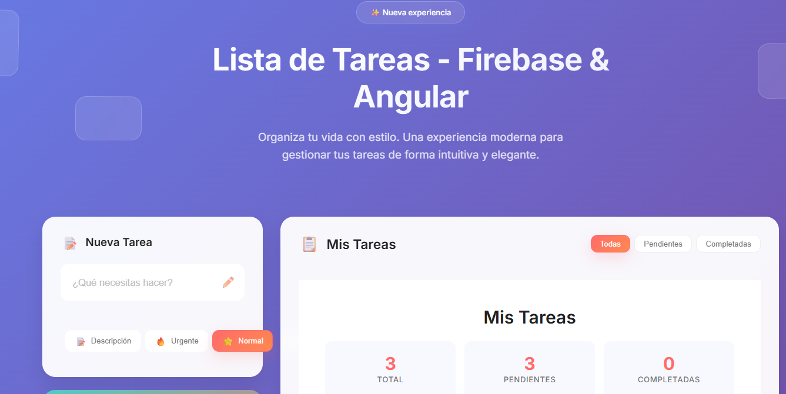
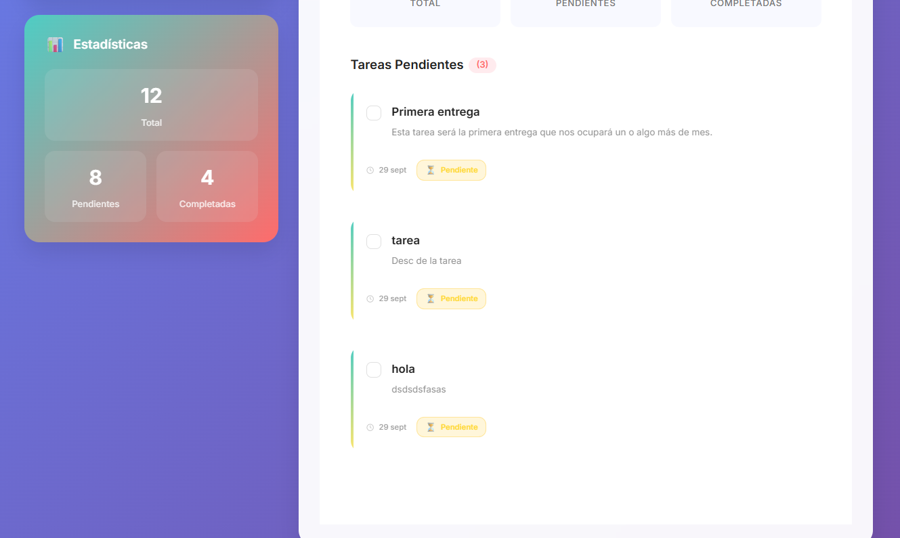

# 📋 Todo App - Angular + Firebase

Aplicación web de gestión de tareas desarrollada con **Angular 18** y **Firebase Firestore**. Permite crear, editar y eliminar tareas con sincronización en tiempo real.

## 📸 Capturas de Pantalla

### Captura 1


### Captura 2


## 🎯 Características

- ✅ Crear, editar y eliminar tareas
- ✅ Marcar tareas como completadas
- ✅ Sincronización en tiempo real con Firebase
- ✅ Diseño responsive y moderno
- ✅ Estadísticas de tareas (total, pendientes, completadas)
- ✅ Interfaz intuitiva y fácil de usar

## 🛠️ Tecnologías Utilizadas

- **Angular 18** - Framework frontend
- **Firebase Firestore** - Base de datos en tiempo real
- **TypeScript** - Lenguaje de programación
- **SCSS** - Estilos

## 📋 Requisitos Previos

- Node.js (versión 18 o superior)
- npm (incluido con Node.js)
- Cuenta de Firebase

## ⚡ Instalación

### 1. Clonar el repositorio

```bash
git clone <url-del-repositorio>
cd angular-firebase-todo-app
```

### 2. Instalar dependencias

```bash
npm install
```

### 3. Configurar Firebase

1. Crea un proyecto en [Firebase Console](https://console.firebase.google.com/)
2. Activa Firestore Database
3. Copia las credenciales de tu proyecto
4. Pega la configuración en `src/environments/environment.ts`:

```typescript
export const environment = {
  production: false,
  firebase: {
    apiKey: "tu-api-key",
    authDomain: "tu-proyecto.firebaseapp.com",
    projectId: "tu-proyecto-id",
    storageBucket: "tu-proyecto.appspot.com",
    messagingSenderId: "tu-sender-id",
    appId: "tu-app-id"
  }
};
```

### 4. Ejecutar la aplicación

```bash
npm start
```

La aplicación estará disponible en `http://localhost:4200`

## 📱 Cómo Usar

1. **Agregar tarea**: Escribe el título y opcionalmente una descripción, luego haz clic en "Agregar Tarea"
2. **Completar tarea**: Marca el checkbox para cambiar el estado de la tarea
3. **Eliminar tarea**: Haz clic en el icono de papelera para eliminar la tarea

## 🏗️ Estructura del Proyecto

```
src/app/
├── components/
│   ├── task-form/       # Formulario para crear tareas
│   ├── task-item/       # Componente de tarea individual
│   └── task-list/       # Lista de todas las tareas
├── models/
│   └── task.interface.ts # Modelo de datos de tarea
├── services/
│   └── task.service.ts   # Servicio para operaciones CRUD
└── environments/         # Configuración de Firebase
```

## 📚 Documentación Adicional

- [SETUP-FIREBASE.md](SETUP-FIREBASE.md) - Guía detallada de configuración de Firebase
- [DOCUMENTACION-COMPONENTES.md](DOCUMENTACION-COMPONENTES.md) - Explicación de los componentes
- [DOCUMENTACION-CONFIGURACION.md](DOCUMENTACION-CONFIGURACION.md) - Configuración del proyecto

## 👤 Autor

Diego - Proyecto académico CIFP Francesc de Borja Moll

## 📅 Fecha de Entrega

Lunes 13 de octubre a las 12:00h
